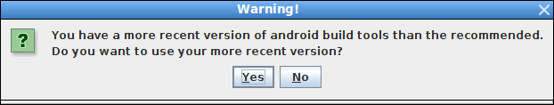

### Setting up IDE

Eclipse Java EE IDE for Web Developers.

Version: Mars.2 Release (4.5.2)
Build id: 20160218-0600

**Getting Eclipse plugins for Gradle**

http://projects.eclipse.org/projects/tools.buildship/downloads


**Getting ADT**

https://marketplace.eclipse.org/content/android-development-tools-eclipse


### Project Creation

Download the "Setup App" from https://libgdx.badlogicgames.com/download.html to "~/software/LibGDX"

```sh
~/software/LibGDX$ java -version
java version "1.8.0_65"
Java(TM) SE Runtime Environment (build 1.8.0_65-b17)
Java HotSpot(TM) 64-Bit Server VM (build 25.65-b01, mixed mode)

~/software/LibGDX$ java -jar gdx-setup.jar
Usage: GdxSetup --dir <dir-name> --name <app-name> --package <package> --mainClass <mainClass> --sdkLocation <SDKLocation> [--excludeModules <modules>] [--extensions <extensions>]
dir ... the directory to write the project files to
name ... the name of the application
package ... the Java package name of the application
mainClass ... the name of your main ApplicationListener
sdkLocation ... the location of your android SDK. Uses ANDROID_HOME if not specified. Ignored if android module is excluded
excludeModules ... the modules to exclude on the project generation separated by ';'. Optional
extensions ... the extensions to include in the project separated by ';'. Optional
```





The complete message displayed is

```
Generating app in /home/droid/onGit/LibGDX-Templates/Eclipse-Gradle
Executing '/home/droid/onGit/LibGDX-Templates/Eclipse-Gradle/gradlew clean --no-daemon eclipse afterEclipseImport'
To honour the JVM settings for this build a new JVM will be forked. Please consider using the daemon: https://docs.gradle.org/2.10/userguide/gradle_daemon.html.
Configuration on demand is an incubating feature.
:android:clean UP-TO-DATE
:core:clean UP-TO-DATE
:desktop:clean UP-TO-DATE
:html:clean UP-TO-DATE
:ios:clean UP-TO-DATE
:eclipseProject
:eclipse
:android:eclipseClasspath
:android:eclipseJdt
:android:eclipseProject
:android:eclipse
:core:eclipseClasspath
:core:eclipseJdt
:core:eclipseProject
:core:eclipse
:desktop:eclipseClasspath
:desktop:eclipseJdt
:desktop:eclipseProject
:desktop:eclipse
:html:eclipseClasspath
:html:eclipseJdt
:html:eclipseProject
:html:generateGdt
:core:compileJavawarning: [options] bootstrap class path not set in conjunction with -source 1.6
1 warning

:core:processResources UP-TO-DATE
:core:classes
:core:jar
:html:compileJavawarning: [options] bootstrap class path not set in conjunction with -source 1.6
1 warning

:html:processResources UP-TO-DATE
:html:classes
:html:warTemplate
:html:eclipse
:ios:eclipseClasspath
:ios:eclipseJdt
:ios:eclipseProject
:ios:eclipse
:desktop:afterEclipseImport

BUILD SUCCESSFUL

Total time: 28.964 secs
Done!
To import in Eclipse: File -> Import -> General -> Existing Projects into Workspace
To import to Intellij IDEA: File -> Open -> YourProject.ipr
```

### Project Contents

```sh
~/onGit/LibGDX-Templates/Eclipse-Gradle$ tree
.
├── android
│   ├── AndroidManifest.xml
│   ├── assets
│   │   └── badlogic.jpg
│   ├── build.gradle
│   ├── ic_launcher-web.png
│   ├── libs
│   │   ├── arm64-v8a
│   │   │   └── libgdx.so
│   │   ├── armeabi
│   │   │   └── libgdx.so
│   │   ├── armeabi-v7a
│   │   │   └── libgdx.so
│   │   ├── x86
│   │   │   └── libgdx.so
│   │   └── x86_64
│   │       └── libgdx.so
│   ├── proguard-project.txt
│   ├── project.properties
│   ├── res
│   │   ├── drawable-hdpi
│   │   │   └── ic_launcher.png
│   │   ├── drawable-mdpi
│   │   │   └── ic_launcher.png
│   │   ├── drawable-xhdpi
│   │   │   └── ic_launcher.png
│   │   ├── drawable-xxhdpi
│   │   │   └── ic_launcher.png
│   │   ├── drawable-xxxhdpi
│   │   │   └── ic_launcher.png
│   │   └── values
│   │       ├── strings.xml
│   │       └── styles.xml
│   └── src
│       └── com
│           └── mygdx
│               └── game
│                   └── AndroidLauncher.java
├── build.gradle
├── core
│   ├── build
│   │   ├── classes
│   │   │   └── main
│   │   │       └── com
│   │   │           └── mygdx
│   │   │               └── game
│   │   │                   └── MyGdxGame.class
│   │   ├── dependency-cache
│   │   ├── libs
│   │   │   └── core-1.0.jar
│   │   └── tmp
│   │       ├── compileJava
│   │       │   └── emptySourcePathRef
│   │       └── jar
│   │           └── MANIFEST.MF
│   ├── build.gradle
│   └── src
│       ├── com
│       │   └── mygdx
│       │       └── game
│       │           └── MyGdxGame.java
│       └── MyGdxGame.gwt.xml
├── desktop
│   ├── build.gradle
│   └── src
│       └── com
│           └── mygdx
│               └── game
│                   └── desktop
│                       └── DesktopLauncher.java
├── gradle
│   └── wrapper
│       ├── gradle-wrapper.jar
│       └── gradle-wrapper.properties
├── gradle.properties
├── gradlew
├── gradlew.bat
├── html
│   ├── build
│   │   ├── classes
│   │   │   └── main
│   │   │       └── com
│   │   │           └── mygdx
│   │   │               └── game
│   │   │                   └── client
│   │   │                       └── HtmlLauncher.class
│   │   ├── dependency-cache
│   │   └── tmp
│   │       └── compileJava
│   │           └── emptySourcePathRef
│   ├── build.gradle
│   ├── src
│   │   └── com
│   │       └── mygdx
│   │           └── game
│   │               ├── client
│   │               │   └── HtmlLauncher.java
│   │               ├── GdxDefinition.gwt.xml
│   │               └── GdxDefinitionSuperdev.gwt.xml
│   ├── war
│   │   ├── index.html
│   │   ├── refresh.png
│   │   ├── soundmanager2-jsmin.js
│   │   ├── soundmanager2-setup.js
│   │   ├── styles.css
│   │   └── WEB-INF
│   │       ├── classes
│   │       │   └── com
│   │       │       └── mygdx
│   │       │           └── game
│   │       │               └── client
│   │       │                   └── HtmlLauncher.class
│   │       ├── lib
│   │       │   ├── core-1.0.jar
│   │       │   ├── gdx-1.9.4.jar
│   │       │   ├── gdx-1.9.4-sources.jar
│   │       │   ├── gdx-backend-gwt-1.9.4.jar
│   │       │   ├── gdx-backend-gwt-1.9.4-sources.jar
│   │       │   ├── gwt-servlet-2.6.0.jar
│   │       │   ├── gwt-user-2.6.1.jar
│   │       │   ├── json-20090211.jar
│   │       │   ├── validation-api-1.0.0.GA.jar
│   │       │   └── validation-api-1.0.0.GA-sources.jar
│   │       └── web.xml
│   └── webapp
│       ├── index.html
│       ├── refresh.png
│       ├── soundmanager2-jsmin.js
│       ├── soundmanager2-setup.js
│       ├── styles.css
│       └── WEB-INF
│           └── web.xml
├── ios
│   ├── build.gradle
│   ├── data
│   │   ├── Default-1024w-1366h@2x~ipad.png
│   │   ├── Default@2x~ipad.png
│   │   ├── Default@2x.png
│   │   ├── Default-375w-667h@2x.png
│   │   ├── Default-414w-736h@3x.png
│   │   ├── Default-568h@2x.png
│   │   ├── Default~ipad.png
│   │   ├── Default.png
│   │   ├── Icon@2x.png
│   │   ├── Icon-72@2x.png
│   │   ├── Icon-72.png
│   │   └── Icon.png
│   ├── Info.plist.xml
│   ├── robovm.properties
│   ├── robovm.xml
│   └── src
│       └── com
│           └── mygdx
│               └── game
│                   └── IOSLauncher.java
├── local.properties
├── _misc
│   ├── Advanced Settings - Choosing Eclipse.png
│   ├── Advanced Settings.png
│   ├── After generating the project.png
│   ├── LibGDX Project Generator.png
│   ├── Message about Android API.png
│   ├── Using build tools message.png
│   ├── Warning about Android API.png
│   └── Warning.png
├── README.md
└── settings.gradle

78 directories, 89 files
```

### Importing Project into Eclipse

Created a directory "/home/droid/Documents/scratchpad/Eclipse-Workspace/LibGDX" so it can be used as an Eclipse workspace

Open Eclipse with the newly created directory as workspace


Hit "Back" and select another version of Gradle


Hit "Back" and proceed with default "Gradle Wrapper" selection and hit "Finish"


